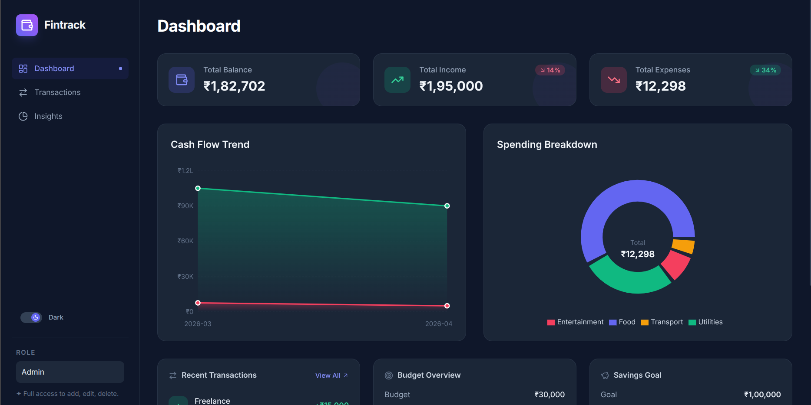
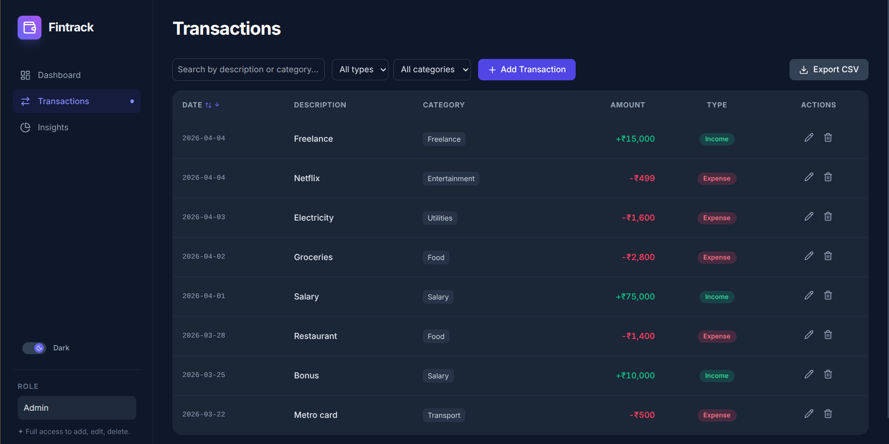
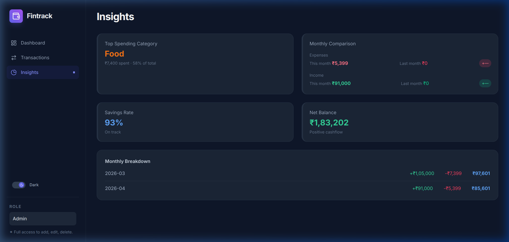
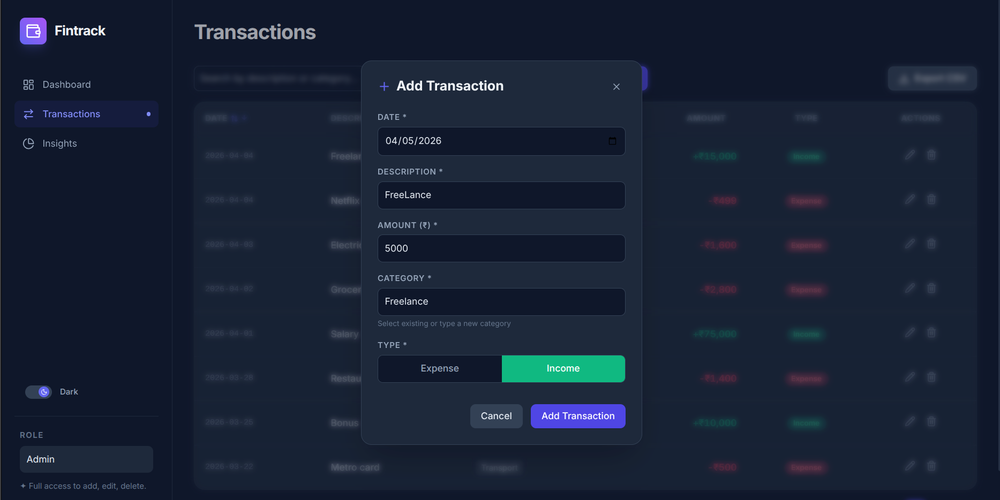

# 💰 Fintrack — Finance Dashboard UI

A clean, modern, and interactive finance dashboard built with React + TypeScript to track income, expenses, and spending insights.



---

## 🚀 Live Demo

> **[View Deployed App →]([https://finance-dashboard.vercel.app](https://finance-dashboard-sandy-eight.vercel.app/?_vercel_share=udfB7HAyjraTbM8LVoKxFrQlyegOAj0A))** 

---

## ✨ Features vs Requirements

| Requirement | Status | Implementation |
|---|---|---|
| **Summary cards** (Balance, Income, Expenses) | ✅ | Animated count-up cards with month-over-month % change |
| **Time-based visualization** | ✅ | Interactive Area chart (Cash Flow Trend) with tooltips |
| **Categorical visualization** | ✅ | Donut chart (Spending Breakdown) + bar chart (Expense Breakdown) |
| **Transaction list with details** | ✅ | Sortable table with date, amount, category, type columns |
| **Filtering** | ✅ | Filter by type (income/expense) and category |
| **Search** | ✅ | Debounced search by description or category |
| **Sorting** | ✅ | Sort by date or amount (ascending/descending) |
| **Role-based UI** (Viewer vs Admin) | ✅ | Sidebar dropdown toggle; Admin can add/edit/delete, Viewer is read-only |
| **Admin: Add transactions** | ✅ | Modal form with validation, category suggestions |
| **Admin: Edit transactions** | ✅ | Pencil icon → modal pre-filled with existing data |
| **Admin: Delete transactions** | ✅ | Trash icon with confirmation modal |
| **Insights: Highest spending category** | ✅ | Top Category card with amount and percentage |
| **Insights: Monthly comparison** | ✅ | Current vs previous month with percentage badges |
| **Insights: Useful observations** | ✅ | Savings rate, net balance, full monthly breakdown table |
| **State management** | ✅ | Zustand store with persist middleware (localStorage) |
| **Responsive design** | ✅ | Mobile sidebar, card-based transaction layout on small screens |
| **Empty state handling** | ✅ | Graceful fallbacks across all views |

### Optional Enhancements Implemented

| Enhancement | Status |
|---|---|
| 🌙 Dark mode | ✅ Toggle in sidebar |
| 💾 Data persistence | ✅ localStorage via Zustand persist |
| 🎬 Animations & transitions | ✅ Staggered fade-ins, count-up, progress fills |
| 📤 CSV export | ✅ Export filtered data with toast confirmation |
| 🔔 Toast notifications | ✅ Success/error feedback on all mutations |
| 🛡️ Error boundary | ✅ Catches render crashes with styled recovery UI |

---

## 📸 Screenshots

| Dashboard | Transactions | Insights |
|---|---|---|
|  |  |  |

### Edit Transaction Modal


---

## 🛠️ Tech Stack

- **Framework:** [React 18](https://react.dev/) with TypeScript / [Vite](https://vite.dev/)
- **Styling:** [Tailwind CSS v3](https://tailwindcss.com/) with dark mode support
- **State Management:** [Zustand](https://github.com/pmndrs/zustand) with persistence
- **Data Visualization:** [Recharts](https://recharts.org/) (Area charts, Pie charts)
- **Icons:** [Lucide React](https://lucide.dev/)
- **Typography:** [Inter](https://fonts.google.com/specimen/Inter) from Google Fonts

---

## 📦 Setup Instructions

### Prerequisites
- Node.js ≥ 18.0
- npm or yarn

### Installation

```bash
git clone <your-repository-url>
cd finance-dashboard
npm install
```

### Development

```bash
npm run dev
```

Open [http://localhost:5173](http://localhost:5173) in your browser.

### Production Build

```bash
npm run build
npm run preview
```

---

## 🏗️ Project Structure

```
src/
├── App.tsx                    # Root layout with tab routing
├── main.tsx                   # React entry point
├── index.css                  # Global styles, animations, Tailwind config
├── components/
│   ├── Common/                # Reusable UI primitives
│   │   ├── Button.tsx         # Variant-based button component
│   │   ├── Card.tsx           # Glass-morphism card wrapper
│   │   ├── EmptyState.tsx     # No-data placeholder
│   │   ├── ErrorBoundary.tsx  # Crash recovery boundary
│   │   ├── Loader.tsx         # Loading spinner
│   │   └── Toast.tsx          # Toast notification system
│   ├── Dashboard/             # Dashboard overview widgets
│   │   ├── SummaryCards.tsx    # Balance, Income, Expenses cards
│   │   ├── DashboardChart.tsx # Area chart (Cash Flow Trend)
│   │   ├── DashboardPieChart.tsx # Donut chart (Spending Breakdown)
│   │   ├── ExpenseChart.tsx   # Bar chart (Expense by Category)
│   │   ├── BudgetOverview.tsx # Budget progress tracker
│   │   ├── SavingGoals.tsx    # Savings goal progress
│   │   └── RecentTransactions.tsx # Latest 5 transactions
│   ├── Transactions/          # Transaction management
│   │   ├── TransactionTable.tsx    # Desktop table + mobile cards
│   │   ├── TransactionModal.tsx    # Add/Edit modal form
│   │   ├── TransactionControls.tsx # Search + filters + actions
│   │   ├── TransactionSearch.tsx   # Debounced search input
│   │   ├── TransactionFilter.tsx   # Type/category dropdowns
│   │   └── ExportCSVButton.tsx     # CSV export with toast
│   ├── Insights/              # Data analysis views
│   │   ├── InsightsPanel.tsx  # Main insights layout
│   │   ├── TopCategory.tsx    # Highest spending category
│   │   └── MonthlyComparison.tsx # Month-over-month comparison
│   ├── Sidebar/               # Navigation + role toggle
│   ├── state/                 # Zustand store
│   ├── services/              # Business logic (filtering)
│   ├── utils/                 # Calculations + formatting
│   ├── constants/             # Role constants
│   ├── data/                  # Mock transaction data
│   ├── theme/                 # Theme toggle logic
│   └── types/                 # TypeScript type definitions
```

---

## 🧠 Architecture Decisions

### State Management
The app uses **Zustand** as a single source of truth. All components read from `useAppStore` directly — no prop drilling. The `persist` middleware ensures transactions, filters, active tab, and role selection survive page refreshes.

### Role-Based UI
Switching between **Viewer** and **Admin** roles controls UI visibility:
- Viewers see a read-only dashboard with no mutation controls
- Admins see Add/Edit/Delete buttons on transactions

This is simulated on the frontend via a sidebar dropdown.

### Responsive Design
- **Desktop:** Full table, charts side-by-side, persistent sidebar
- **Tablet:** Collapsible sidebar, 2-column grid
- **Mobile:** Card-based transactions, stacked layout, hamburger menu

### Toast Notifications
A lightweight pub/sub toast system (`showToast()`) provides instant feedback for all user actions without requiring a React context provider.
